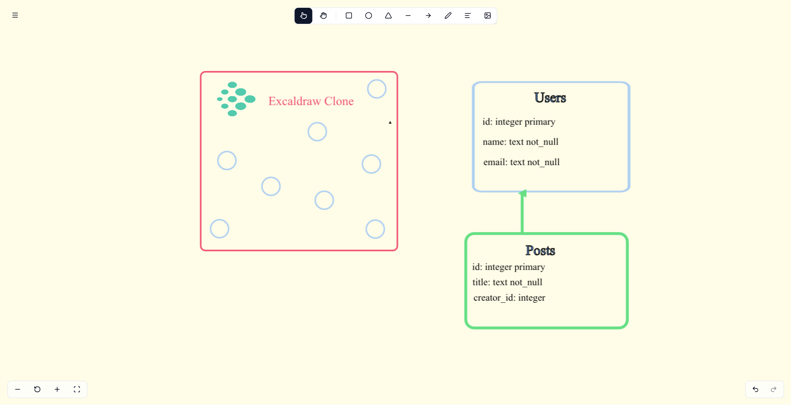

# Excaldraw Clone

A lightweight Excalidraw-like canvas editor built with Next.js and Fabric.js.

> [!WARNING]
> This project is a work in progress and is **not production-ready** yet. Persistence uses browser localStorage for now and may be cleared by the browser at any time. and you can face some issues with the editor.

## Screenshots

## Tech Stack

- **Next.js (App Router)**
- **React + TypeScript**
- **Tailwind CSS**
- **shadcn/ui (Radix UI)**
- **Lucide** (icons)
- **Fabric.js v6.7.x**
- **pnpm** (package manager)

## Implemented Features

- **Canvas editing**: select, pan, rectangles, circles, triangles, line, arrow, freehand, text
- **Toolbar**: responsive with horizontal scroll on small screens
- **Tool settings**: desktop panel and mobile drawer
- **Zoom controls** and **history controls** (undo/redo)
- **Theme switching** (light/dark/system) with workspace background sync
- **Image import** via file picker (stored as data URLs for persistence)
- **Persistence**: scene objects and editor state saved to browser storage

## Persistence (Temporary)

- The app currently persists data in **localStorage** only.
- We separate and store:
  - **Scene** (objects) at `excaldraw-clone:scene`
  - **Editor state** (viewport, background color) at `excaldraw-clone:editor`
- Images are stored as **data URLs** to avoid transient `blob:` issues and ensure reload reliability.
- Note: localStorage has size limits; large scenes or many images may not fit.

## Roadmap

- **Authentication**
- **Dashboard**
- **Admin dashboard**
- **Service worker (offline)**
- **Background sync when the user connects or creates an account**
- **AI image generation**
- **Splash images**
- **Upload and display local media library**
